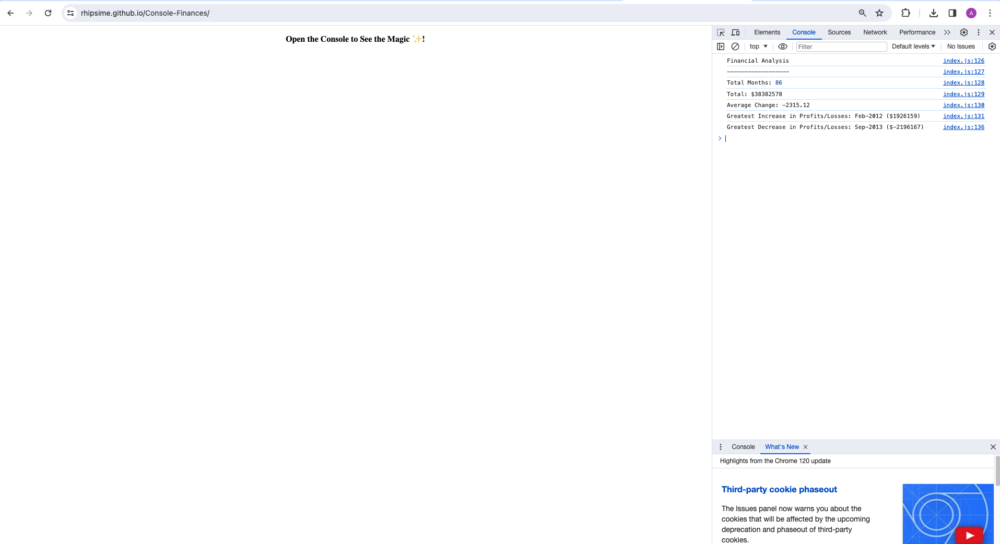

# Console Finances

## Overview

This repository contains JavaScript code for analysing financial records of a company. This project was completed as part of a JavaScript coding challenge and demonstrates skills in data analysis and manipulation.

## File Structure and Naming Conventions

The project follows a clean file structure with organised code. Key files include:

- `index.js`: The main JavaScript file for financial analysis.
- `README.md`: Documentation for the project.
- `LICENSE`: MIT License
- `images`: Folder for screenshots
## Code Quality

- **Variable Naming:** Meaningful and descriptive variable names are used for better code readability.
- **Indentation:** Consistent indentation is maintained throughout the code for clarity.
- **Comments:** Quality comments are provided to explain complex logic and enhance code understanding.

## Commit Messages

The repository contains multiple descriptive commit messages, summarizing each significant change made to the codebase. This aids in tracking the development history and understanding the evolution of the project.

## Deployed Application

The live version of the Console Finances application can be accessed [here](https://rhipsime.github.io/Console-Finances/).

## Screenshots

## How to Run Locally

1. Clone the repository to your local machine.
2. Open the `index.js` file and analyze the financial records using JavaScript.
3. Run the script in a browser or Node.js environment.

## Contribution

Contributions to improve the project are welcome.

---